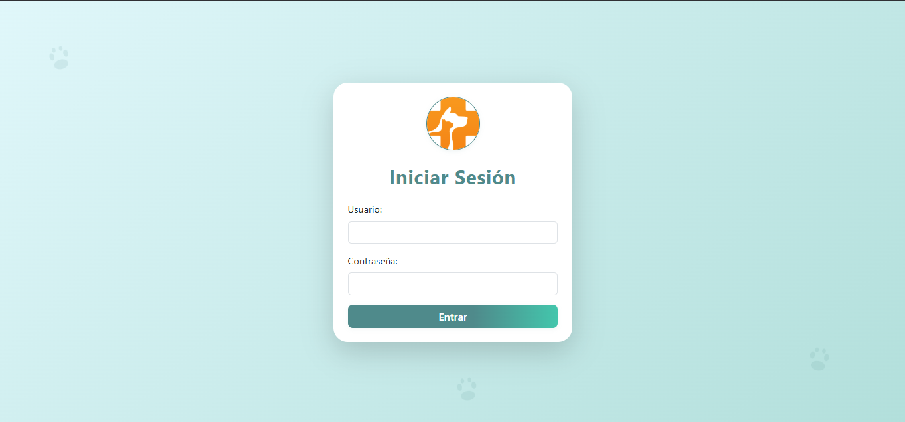
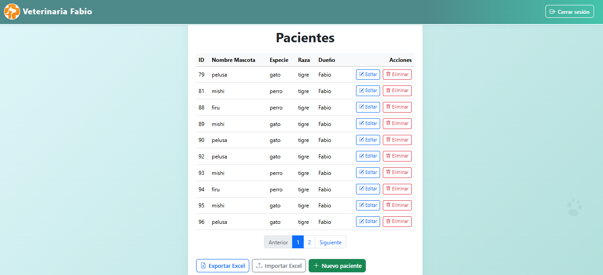
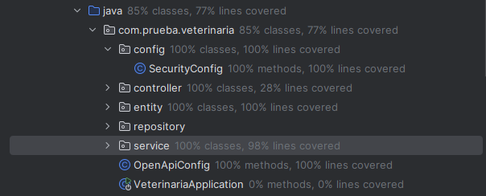
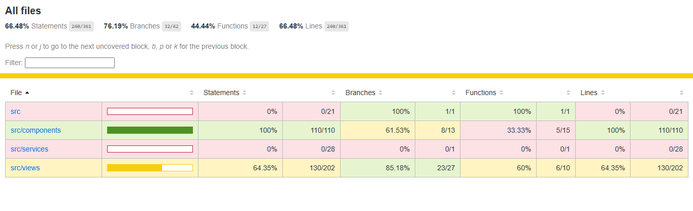

# Sistema de Gestión de Pacientes - Veterinaria Fabio

Este proyecto es una aplicación web para la gestión de pacientes en una veterinaria. Permite realizar operaciones CRUD sobre los pacientes, importar/exportar sus datos en formato Excel y cuenta con autenticación básica con auth para proteger la información sensible.

Lo que se usé para desarrollarla fue:

- Frontend desarrollado en Vue 3 + Vite
- Backend en Spring Boot + PostgreSQL

También cuenta con:

- Cobertura de pruebas unitarias ≥ 65%, tanto para el backend como para el frontend

Funcionalidades principales:

Generales

* Página de login
* Autenticación básica protegida con auth
* Solo usuarios autenticados pueden ver/editar pacientes
* CRUD de pacientes (crear, consultar, editar, eliminar)
* Exportación de pacientes a archivo .xlsx
* Importación de pacientes desde archivo .xlsx
* Frontend responsivo

Pruebas unitarias:

Backend: Spring Boot con @WebMvcTest, Mockito y pruebas a servicios, controladores y entidades.

Frontend: Vitest y Vue Test Utils. Se probaron las vistas y componentes (Login, PacientesView, Formularios, Tabla, Sidebar).

Cobertura: Ambos lados tienen ≥ 65% de cobertura.

Tecnologías utilizadas:

Backend:

* Java 21
* Spring Boot 3.x
* Spring Web, JPA, Validation
* PostgreSQL
* Apache POI (para archivos Excel)
* JUnit + Mockito (pruebas)

Frontend:

* Vue 3 + Vite
* Bootstrap 5
* SweetAlert2
* Axios
* Vue Router
* Vitest + Vue Test Utils (tests)

 Estructura del proyecto:

/backend
 └── src
      └── main/java/...        # Código fuente backend
      └── test/java/...        # Pruebas unitarias backend
/frontend
 └── src
      └── views/               # Vistas Login y Pacientes
      └── components/          # Formulario, tabla y navbar
      └── services/            # API axios
 └── tests/                    # Pruebas unitarias Vitest

 ¿Cómo ejecutar?

 1. Clonar el repositorio:

* https://github.com/usuario/veterinaria.git
* cd veterinaria

 2. Backend (Spring Boot):

* cd backend
* ./mvnw spring-boot:run o dede el IDE.

3. Frontend (Vue):

* cd ../frontend
* npm install
* npm run dev

Credenciales de prueba:

* Usuario: admin
* Contraseña: admin123

Autor:

* Desarrollado por Inge. Fabiolxp 

